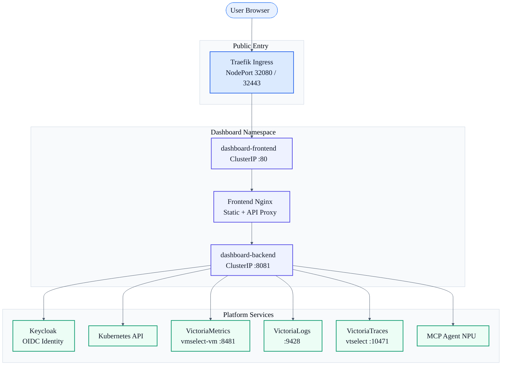
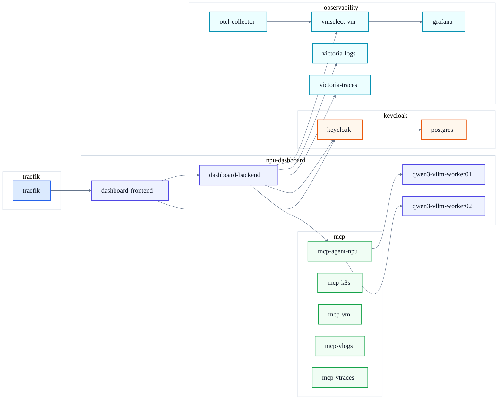
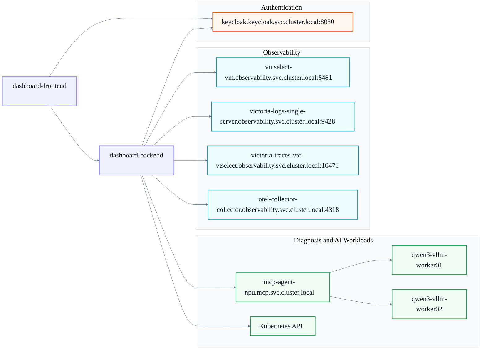

# Kubernetes AI Infrastructure Dashboard

[KO](./README.md)

<a href="https://youtu.be/jrAfJNdNkqc">
  
</a>

> Demo video: click the image above to open the YouTube walkthrough.

This project is an operational dashboard for AI infrastructure running on Kubernetes.  
It brings cluster state, workloads, accelerator usage, logs, and traces into one place, and it is designed to be deployed in a protected production-like environment with Keycloak OIDC authentication.

This is not just a UI sample. The repository is intended to represent a deployable dashboard stack for real Kubernetes-based AI infrastructure operations.

## Project Overview

This dashboard is designed for scenarios like these:

- You want to inspect multiple nodes and workloads from a single screen
- You want quick visibility into NPU resource usage
- You want to use the currently completed NPU-focused operational views while GPU support is planned next
- You want pod-level metrics, logs, events, and describe information in one workflow
- You want the dashboard to fit an operational environment that already includes Keycloak and observability components

The repository is organized as follows:

- `frontend/`: React/Vite dashboard UI
- `backend/`: Go-based API server
- `k8s/`: Kubernetes deployment manifests
- `wiki/`: deployment and architecture notes

## Key Features

- Cluster overview dashboard
- Node metrics dashboard
- Pod / container map visualization
- Pod-level analysis
  - metrics
  - logs
  - events
  - describe information
- NPU visibility and workload mapping
- GPU-oriented support is planned, while the currently completed operational path is NPU-first
- Keycloak OIDC login
- VictoriaMetrics / VictoriaLogs / VictoriaTraces integration
- Operational diagnosis chat workflow integration

## Deployment Architecture

The runtime layout is built around this flow:

```text
User Browser
  -> Traefik Ingress (HTTPS)
  -> dashboard-frontend Service
  -> frontend nginx (/api proxy)
  -> dashboard-backend Service
  -> Kubernetes API
  -> Keycloak
  -> Metrics / Logs / Traces backend
```

Core deployment principles:

- The frontend is exposed only behind an HTTPS ingress
- The backend remains private as a `ClusterIP` service
- Authentication and external-system integration are handled in the backend
- Environment-specific values are injected through `ConfigMap`

## Infrastructure Overview

This dashboard is part of a broader Kubernetes platform, not a standalone app.  
The dashboard itself runs in `npu-dashboard`, authentication is handled by `keycloak`, observability data comes from `observability`, operator-assist services live in `mcp`, and public entry is handled by `traefik`.

The following snapshot reflects the cluster state as of 2026-03-21.

### Kubernetes Nodes

| Node | Role | Kubernetes Version | Internal IP | OS | Kernel | Runtime |
| --- | --- | --- | --- | --- | --- | --- |
| `master` | control-plane | `v1.29.12` | `192.168.160.180` | Ubuntu 24.04.4 LTS | `6.8.0-90-generic` | `containerd://1.7.23` |
| `worker-01` | worker | `v1.29.12` | `192.168.160.59` | Ubuntu 24.04.4 LTS | `6.8.0-90-generic` | `containerd://1.7.23` |
| `worker-02` | worker | `v1.29.12` | `192.168.160.69` | Ubuntu 24.04.4 LTS | `6.8.0-90-generic` | `containerd://1.7.23` |

### External Entry Points

| Component | Host | Access Path | Notes |
| --- | --- | --- | --- |
| Dashboard | `dashboard.home.arpa` | `https://dashboard.home.arpa:32443` | exposed through Traefik Ingress |
| Keycloak | `keycloak.home.arpa` | `https://keycloak.home.arpa:32443` | OIDC login endpoint |
| Traefik | NodePort | `32080` / `32443` | HTTP / HTTPS entry |

### Infrastructure Diagram



### Namespace Layout



### `npu-dashboard` Namespace

This namespace contains both the dashboard stack itself and the AI-serving workloads it operates against.  
The environment example documented in this README is based on a live deployment snapshot from a Rebellions NPU environment.

#### Pods

| Pod | Status | Notes |
| --- | --- | --- |
| `dashboard-backend-85886944f9-877vs` | Running | dashboard API server |
| `dashboard-frontend-6c96f8684b-zpklw` | Running | dashboard UI |
| `qwen3-vllm-worker01-767b9c9775-9q8h9` | Running | model serving workload |
| `qwen3-vllm-worker02-797c6c869c-wxshk` | Running | model serving workload |
| `model-download-worker01` | Completed | model download job |
| `model-download-worker02` | Completed | model download job |
| `qwen3-compile-worker01` | Completed | model compilation job |
| `qwen3-compile-worker02` | Completed | model compilation job |

#### Services

| Service | Type | Cluster IP | Port | Role |
| --- | --- | --- | --- | --- |
| `dashboard-backend` | ClusterIP | `10.96.170.52` | `8081/TCP` | dashboard API |
| `dashboard-frontend` | ClusterIP | `10.100.88.226` | `80/TCP` | dashboard UI |
| `qwen3-vllm-worker01` | ClusterIP | `10.106.26.69` | `80/TCP` | model service |
| `qwen3-vllm-worker02` | ClusterIP | `10.99.145.92` | `80/TCP` | model service |

### `keycloak` Namespace

This namespace handles authentication and user login.

#### Pods

| Pod | Status | Role |
| --- | --- | --- |
| `keycloak-6fd9878c84-m6rws` | Running | OIDC identity server |
| `postgres-64b89d5d45-hzs9g` | Running | Keycloak database |

#### Services

| Service | Type | Cluster IP | Port | Role |
| --- | --- | --- | --- | --- |
| `keycloak` | ClusterIP | `10.107.199.215` | `8080/TCP` | internal cluster access |
| `keycloak-nodeport` | NodePort | `10.100.74.72` | `8080:30080/TCP` | legacy external access path |
| `postgres` | ClusterIP | `10.111.78.155` | `5432/TCP` | database |

### `observability` Namespace

This namespace hosts metrics, logs, traces, and OTEL collection.

#### Main Components

| Component | Service | Port | Purpose |
| --- | --- | --- | --- |
| OTel Collector | `otel-collector-collector` | `4317`, `4318` | OTLP collection |
| VictoriaLogs | `victoria-logs-single-server` | `9428` | log queries |
| VictoriaTraces | `victoria-traces-vtc-vtselect` | `10471` | Jaeger-compatible trace queries |
| VictoriaMetrics | `vmselect-vm` | `8481` | Prometheus-compatible metrics queries |
| Grafana | `vm-grafana` | `80:32200` | visualization UI |

#### Pods

| Pod | Status |
| --- | --- |
| `otel-collector-collector-mczhm` | Running |
| `otel-collector-collector-pxgqf` | Running |
| `otel-collector-collector-th4qb` | Running |
| `victoria-logs-single-server-0` | Running |
| `victoria-traces-vtc-vtinsert-7b89c7b758-gm9qd` | Running |
| `victoria-traces-vtc-vtinsert-7b89c7b758-scgg8` | Running |
| `victoria-traces-vtc-vtselect-64b4dcf4d5-ml4zm` | Running |
| `victoria-traces-vtc-vtselect-64b4dcf4d5-ppllm` | Running |
| `victoria-traces-vtc-vtstorage-0` | Running |
| `victoria-traces-vtc-vtstorage-1` | Running |
| `vm-grafana-759df59898-g8dlj` | Running |
| `vm-kube-state-metrics-6d7f5989d6-qt72v` | Running |
| `vm-victoria-metrics-operator-85fb9869c6-4j2hx` | Running |
| `vma-local-fjqcw` | Running |
| `vma-local-sskdd` | Running |
| `vma-local-tpnwm` | Running |
| `vma-master-local-xghcz` | Running |
| `vmagent-vm-6dff48564-k7hbb` | Running |
| `vminsert-vm-5fcd97cd7f-rmzlq` | Running |
| `vmselect-vm-0` | Running |
| `vmstorage-vm-0` | Running |
| `vmstorage-vm-1` | Running |
| `obs-debug` | Completed |
| `vm-debug` | Completed |

#### Services

| Service | Type | Cluster IP | Port |
| --- | --- | --- | --- |
| `otel-collector-collector` | ClusterIP | `10.102.38.225` | `4317/TCP`, `4318/TCP` |
| `otel-collector-collector-headless` | ClusterIP | `None` | `4317/TCP`, `4318/TCP` |
| `otel-collector-collector-monitoring` | ClusterIP | `10.99.143.58` | `8888/TCP` |
| `victoria-logs-single-server` | ClusterIP | `None` | `9428/TCP` |
| `victoria-traces-vtc-vtinsert` | ClusterIP | `10.97.72.122` | `10481/TCP` |
| `victoria-traces-vtc-vtselect` | ClusterIP | `10.106.78.153` | `10471/TCP` |
| `victoria-traces-vtc-vtstorage` | ClusterIP | `None` | `10491/TCP` |
| `vm-grafana` | NodePort | `10.97.219.151` | `80:32200/TCP` |
| `vm-kube-state-metrics` | ClusterIP | `10.111.1.222` | `8080/TCP` |
| `vm-victoria-metrics-operator` | ClusterIP | `10.98.212.113` | `8080/TCP`, `9443/TCP` |
| `vmagent-vm` | ClusterIP | `10.102.41.158` | `8429/TCP` |
| `vminsert-vm` | ClusterIP | `10.108.106.186` | `8480/TCP` |
| `vmselect-vm` | ClusterIP | `None` | `8481/TCP` |
| `vmstorage-vm` | ClusterIP | `None` | `8482/TCP`, `8400/TCP`, `8401/TCP` |

### `mcp` Namespace

This namespace contains the MCP-side helper services used for operational diagnosis workflows.

#### Pods

| Pod | Status | Role |
| --- | --- | --- |
| `mcp-agent-npu-78c97cdb54-4kcqx` | Running | NPU diagnosis agent |
| `mcp-k8s-6dc6dbff8b-zc74f` | Running | Kubernetes query worker |
| `mcp-vlogs-5464bcd65f-hjwq2` | Running | log query worker |
| `mcp-vm-6474c79f65-crpqp` | Running | metrics query worker |
| `mcp-vtraces-98b7846b4-n7x7x` | Running | traces query worker |

#### Services

| Service | Type | Cluster IP | Port |
| --- | --- | --- | --- |
| `mcp-agent-npu` | ClusterIP | `10.105.76.152` | `80/TCP` |
| `mcp-k8s-svc` | ClusterIP | `10.100.201.116` | `80/TCP` |
| `mcp-vlogs-svc` | ClusterIP | `10.108.97.238` | `80/TCP` |
| `mcp-vm-svc` | ClusterIP | `10.101.131.160` | `80/TCP` |
| `mcp-vtraces-svc` | ClusterIP | `10.97.211.233` | `80/TCP` |

### `traefik` Namespace

This namespace provides the public HTTPS entrypoints for the dashboard and Keycloak.

#### Pods

| Pod | Status |
| --- | --- |
| `traefik-578db7b488-2vlnf` | Running |

#### Services

| Service | Type | Cluster IP | Port |
| --- | --- | --- | --- |
| `traefik` | NodePort | `10.101.128.234` | `80:32080/TCP`, `443:32443/TCP` |

### Ingress Configuration

The cluster currently exposes these two ingress resources publicly.

| Namespace | Ingress | Class | Host | Ports |
| --- | --- | --- | --- | --- |
| `keycloak` | `keycloak` | `traefik` | `keycloak.home.arpa` | `80`, `443` |
| `npu-dashboard` | `dashboard` | `traefik` | `dashboard.home.arpa` | `80`, `443` |

### Exporter and Metric Sources

The dashboard reads metrics through exporter pods and the observability pipeline.

#### Exporter Pods

| Namespace | Pod | Role |
| --- | --- | --- |
| `monitoring` | `node-exporter-7gjht` | node metrics |
| `monitoring` | `node-exporter-f6nmp` | node metrics |
| `monitoring` | `node-exporter-xmxc8` | node metrics |
| `rbln-system` | `rbln-metrics-exporter-g7z7j` | NPU metrics |
| `rbln-system` | `rbln-metrics-exporter-m5gcl` | NPU metrics |

#### Exporter Services

| Namespace | Service | Port |
| --- | --- | --- |
| `kube-system` | `dcgm-exporter` | `9400/TCP` |
| `kube-system` | `ix-amd-gpu-exporter-monitor` | `2021/TCP` |
| `kube-system` | `ix-nvidia-gpu-exporter-monitor` | `9835/TCP` |
| `monitoring` | `node-exporter` | `9100/TCP` |
| `rbln-system` | `rbln-metrics-exporter-service` | `9090/TCP` |

### Dashboard Runtime Dependency Map

The dashboard runtime depends on the internal services below.  
This diagram also reflects the actual communication paths between frontend and backend, and between `mcp-agent-npu` and the NPU inference workloads.



### Deployment Notes

This dashboard is deployed under these operating principles:

- `dashboard-frontend` and `dashboard-backend` both remain private as `ClusterIP` services
- public exposure is handled only through Traefik Ingress
- authentication is handled with Keycloak OIDC
- frontend and backend both communicate with Keycloak, for browser login and server-side token verification respectively
- metrics, logs, and traces are queried through internal Service DNS addresses in the `observability` namespace
- diagnosis workflows are routed through `mcp-agent-npu`, which in turn talks to `qwen3-vllm-worker01` and `qwen3-vllm-worker02`

### Why This Infrastructure Matters

The point of this project is not just to render a frontend. It is to unify:

- Kubernetes resource state
- AI workload status
- node metrics
- NPU usage visibility
- logs and traces
- authenticated access control
- diagnosis-assist workflows

In other words, this dashboard is designed as a single operational entrypoint for AI infrastructure.

## Kubernetes Deployment Guide

Deployment resources are located under `k8s/npu-dashboard/`.

Key files:

- `namespace.yaml`
- `frontend-configmap.yaml`
- `backend-configmap.yaml`
- `rbac.yaml`
- `frontend.yaml`
- `backend.yaml`
- `dashboard-ingress.yaml`
- `kustomization.yaml`

### 1. Check frontend configuration

Review `k8s/npu-dashboard/frontend-configmap.yaml` and confirm:

- `VITE_OIDC_AUTHORITY`
- `VITE_OIDC_CLIENT_ID`
- `VITE_OIDC_REDIRECT_PATH`
- `VITE_OIDC_POST_LOGOUT_REDIRECT_PATH`
- `VITE_ACCELERATOR_TYPE`

### 2. Check backend configuration

Review `k8s/npu-dashboard/backend-configmap.yaml` and confirm:

- `FRONTEND_ORIGIN`
- `OIDC_ISSUER_URL`
- `OIDC_DISCOVERY_URL`
- `OIDC_JWKS_URL`
- `METRICS_BASE_URL`
- `LOGS_BASE_URL`
- `TRACES_BASE_URL`
- `MCP_AGENT_BASE_URL`

### 3. Check ingress configuration

Review `k8s/npu-dashboard/dashboard-ingress.yaml` and confirm:

- public host
- ingress class
- TLS secret name

### 4. Deploy the full stack

```bash
kubectl apply -k k8s/npu-dashboard
```

This applies namespace, ConfigMaps, RBAC, frontend, backend, and ingress together.

### 5. Verify deployment state

```bash
kubectl get all -n npu-dashboard
kubectl get ingress -n npu-dashboard
kubectl logs deploy/dashboard-backend -n npu-dashboard
kubectl logs deploy/dashboard-frontend -n npu-dashboard
```

### 6. Validate in the browser

Open the dashboard URL and verify:

- login redirects to Keycloak
- login returns to the dashboard correctly
- `/api/clusters/summary` loads successfully
- metrics, logs, and traces screens connect correctly

## Integration Points

This dashboard depends on several surrounding platform services.

### Keycloak

The frontend should use the external HTTPS issuer, while the backend should use internal service discovery and JWKS endpoints.

Typical split:

- frontend: `https://keycloak.<domain>/realms/<realm>`
- backend: `http://keycloak.<namespace>.svc.cluster.local:8080/...`

Keycloak must be configured with:

- realm
- dashboard client
- redirect URIs
- web origins

### Ingress and TLS

OIDC PKCE requires a secure browser context, so HTTPS ingress is part of the intended architecture.  
The provided manifests assume Traefik, but the ingress manifest can be adjusted for another controller if needed.

### Metrics

Node and workload metrics are fetched through a Prometheus-compatible API.

Relevant settings:

- `METRICS_BASE_URL`
- `NODE_METRICS_JOB`
- `NODE_METRICS_MAPPING_STRATEGY`
- `NODE_METRICS_POD_NAMESPACE`

### Logs

Logs are fetched through the VictoriaLogs HTTP API.

Relevant setting:

- `LOGS_BASE_URL`

### Traces

Traces are fetched through a Jaeger-compatible VictoriaTraces API.

Relevant setting:

- `TRACES_BASE_URL`

### MCP Agent

Operational diagnosis workflows can optionally use MCP services.

Relevant settings:

- `MCP_AGENT_BASE_URL`
- `DIAGNOSIS_CHAT_TIMEOUT`

## Operational Checks

After deployment, this is the recommended validation order:

1. Verify pods in `npu-dashboard`
2. Verify the dashboard ingress
3. Check public dashboard access
4. Validate the Keycloak login flow
5. Validate summary and node metrics API calls
6. Validate logs and traces queries

## Common Issues

### Login fails

- Make sure both dashboard and Keycloak are exposed over HTTPS
- Confirm Keycloak redirect URIs and web origins
- Confirm frontend `VITE_OIDC_AUTHORITY` points to the public HTTPS address
- Confirm backend discovery and JWKS endpoints are reachable inside the cluster

### API returns 401

- Check whether the token is actually being sent
- Check the value of `AUTH_ENABLED`
- Check the issuer / discovery / JWKS combination

### Metrics or logs are empty

- Check backend URLs
- Check whether data is actually present in the observability stack
- Check metric job names and mapping strategy

## Image Build

The default manifests use GHCR images:

- `ghcr.io/jwjinn/kubernetes-dashboard-frontend:latest`
- `ghcr.io/jwjinn/kubernetes-dashboard-backend:latest`

To build images manually:

```bash
cd frontend
docker build -t kubernetes-dashboard-frontend:local .
```

```bash
cd backend
docker build -t kubernetes-dashboard-backend:local .
```

If you publish your own images, update the image fields in `frontend.yaml` and `backend.yaml`.

## Additional Docs

- `wiki/npu-dashboard-deployment.md`
- `wiki/npu-dashboard-yaml-guide.md`
- `wiki/oidc-traefik-resolution-history.md`

The recommended reading flow is:

1. Read this README for the big picture
2. Read the YAML guide for manifest intent
3. Read the deployment guide for step-by-step rollout
4. Read the OIDC / HTTPS history when authentication or ingress behavior needs background
