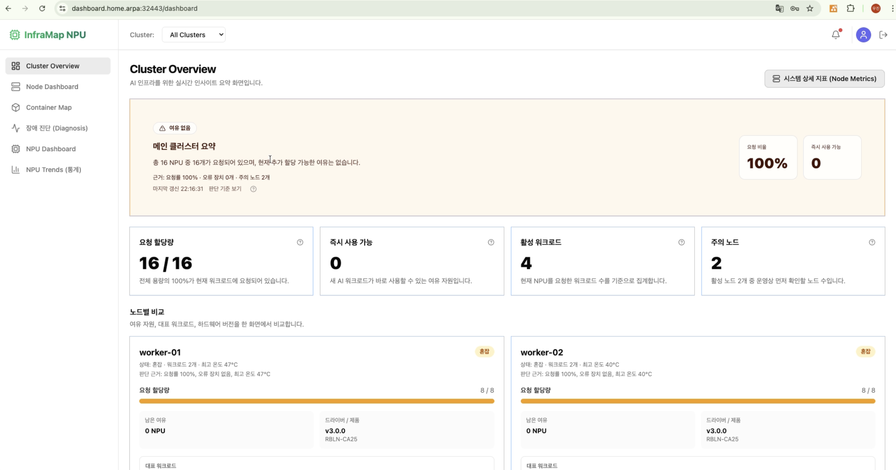
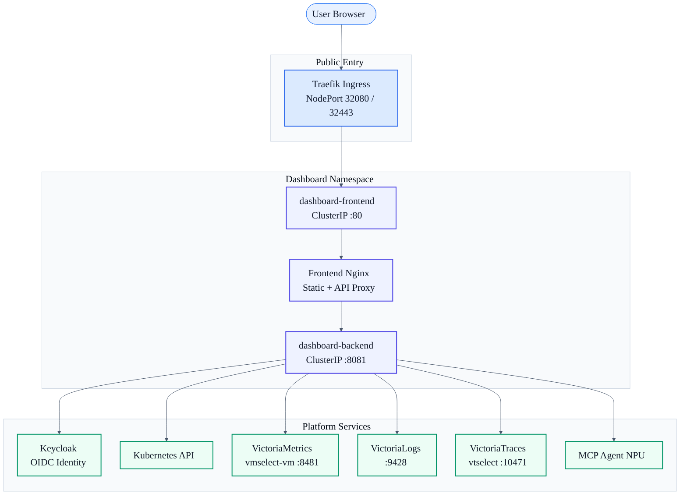
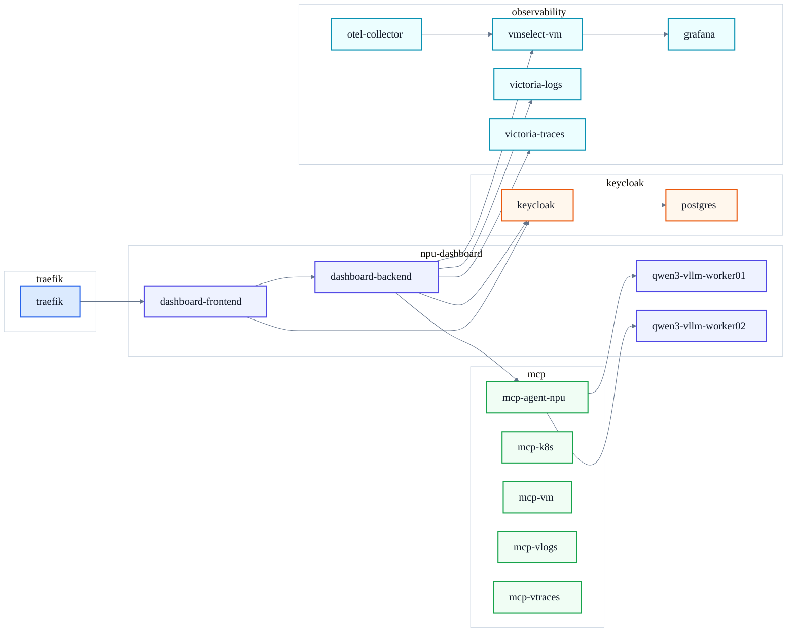
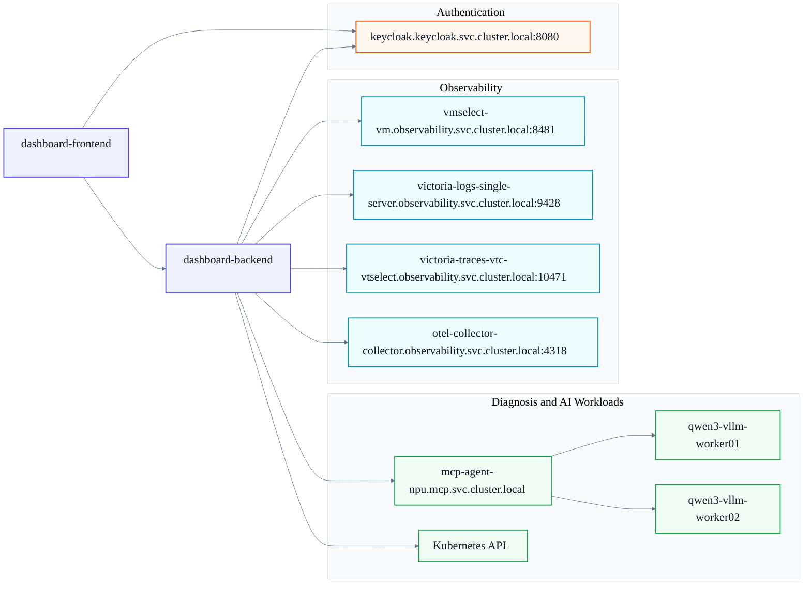

# Kubernetes AI Infrastructure Dashboard

[EN](./README.en.md)

<a href="https://youtu.be/jrAfJNdNkqc">
  
</a>

> Demo video: click the image above to open the YouTube walkthrough.

Kubernetes 기반 AI 인프라를 운영하기 위한 대시보드입니다.  
클러스터 상태, 워크로드, 가속기 자원, 로그와 트레이스를 하나의 화면에서 확인할 수 있고, Keycloak OIDC 인증을 통해 운영 환경에 맞게 보호된 형태로 배포할 수 있습니다.

이 프로젝트는 단순한 UI 샘플이 아니라, Kubernetes 위에 실제로 배포해서 사용하는 운영형 대시보드를 목표로 합니다.

## 프로젝트 소개

이 대시보드는 다음과 같은 상황을 위해 만들어졌습니다.

- 여러 노드와 워크로드를 한 번에 보고 싶을 때
- NPU 가속기 자원 사용 현황을 빠르게 확인하고 싶을 때
- GPU 지원은 향후 확장 예정인 상태에서, 현재 우선 개발 완료된 NPU 운영 화면을 활용하고 싶을 때
- 특정 Pod의 메트릭, 로그, 이벤트, describe 정보를 한 자리에서 보고 싶을 때
- Keycloak 인증과 observability 스택을 포함한 운영 환경에 맞춰 대시보드를 배포하고 싶을 때

현재 저장소는 아래 구성으로 이루어져 있습니다.

- `frontend/`: React/Vite 기반 대시보드 UI
- `backend/`: Go 기반 API 서버
- `k8s/`: Kubernetes 배포 매니페스트
- `wiki/`: 배포 및 구성 관련 상세 문서

## 주요 기능

- 클러스터 요약 대시보드
- 노드 메트릭 대시보드
- Pod/컨테이너 맵 시각화
- Pod 단위 상세 분석
  - 메트릭
  - 로그
  - 이벤트
  - describe 정보
- NPU 장비 현황 및 워크로드 매핑
- GPU 화면은 구조를 고려해두었고, 현재는 NPU 기능을 우선 개발 완료
- Keycloak OIDC 로그인
- VictoriaMetrics / VictoriaLogs / VictoriaTraces 연동
- 운영 진단용 챗 API 연동

## 배포 아키텍처

기본 배포 구조는 아래와 같습니다.

```text
사용자 브라우저
  -> Traefik Ingress (HTTPS)
  -> dashboard-frontend Service
  -> frontend 내부 nginx (/api 프록시)
  -> dashboard-backend Service
  -> Kubernetes API
  -> Keycloak
  -> Metrics / Logs / Traces backend
```

운영 원칙은 명확합니다.

- 프론트엔드는 외부 HTTPS 진입점 뒤에 둡니다.
- 백엔드는 외부에 직접 노출하지 않고 `ClusterIP`로만 운영합니다.
- 인증과 외부 시스템 연동은 백엔드에서 처리합니다.
- 환경별 주소와 설정은 `ConfigMap`으로 주입합니다.

## Infrastructure Overview

이 프로젝트는 단일 애플리케이션이 아니라, Kubernetes 클러스터 위에서 여러 운영 컴포넌트와 함께 동작하는 AI 인프라 대시보드입니다.  
대시보드는 `npu-dashboard` 네임스페이스에 배포되며, 인증은 `keycloak`, 관측 데이터는 `observability`, 운영 보조 도구는 `mcp`, 외부 진입점은 `traefik`를 통해 연결됩니다.

아래 내용은 2026-03-21 기준 클러스터 스냅샷입니다.

### Kubernetes Nodes

| Node | Role | Kubernetes Version | Internal IP | OS | Kernel | Runtime |
| --- | --- | --- | --- | --- | --- | --- |
| `master` | control-plane | `v1.29.12` | `192.168.160.180` | Ubuntu 24.04.4 LTS | `6.8.0-90-generic` | `containerd://1.7.23` |
| `worker-01` | worker | `v1.29.12` | `192.168.160.59` | Ubuntu 24.04.4 LTS | `6.8.0-90-generic` | `containerd://1.7.23` |
| `worker-02` | worker | `v1.29.12` | `192.168.160.69` | Ubuntu 24.04.4 LTS | `6.8.0-90-generic` | `containerd://1.7.23` |

### External Entry Points

| Component | Host | Access Path | Notes |
| --- | --- | --- | --- |
| Dashboard | `dashboard.home.arpa` | `https://dashboard.home.arpa:32443` | Traefik Ingress를 통해 접근 |
| Keycloak | `keycloak.home.arpa` | `https://keycloak.home.arpa:32443` | OIDC 로그인용 |
| Traefik | NodePort | `32080` / `32443` | HTTP / HTTPS 진입점 |

### Infrastructure Diagram



### Namespace Layout



### `npu-dashboard` Namespace

대시보드 본체와 AI 워크로드가 함께 존재하는 네임스페이스입니다.  
현재 이 README에 적은 환경 예시는 리벨리온 NPU 환경에서 실제로 구동한 배포 스냅샷을 기준으로 정리했습니다.

#### Pods

| Pod | Status | Notes |
| --- | --- | --- |
| `dashboard-backend-85886944f9-877vs` | Running | 대시보드 API 서버 |
| `dashboard-frontend-6c96f8684b-zpklw` | Running | 대시보드 UI |
| `qwen3-vllm-worker01-767b9c9775-9q8h9` | Running | 모델 serving workload |
| `qwen3-vllm-worker02-797c6c869c-wxshk` | Running | 모델 serving workload |
| `model-download-worker01` | Completed | 모델 다운로드 작업 |
| `model-download-worker02` | Completed | 모델 다운로드 작업 |
| `qwen3-compile-worker01` | Completed | 모델 컴파일 작업 |
| `qwen3-compile-worker02` | Completed | 모델 컴파일 작업 |

#### Services

| Service | Type | Cluster IP | Port | Role |
| --- | --- | --- | --- | --- |
| `dashboard-backend` | ClusterIP | `10.96.170.52` | `8081/TCP` | 대시보드 API |
| `dashboard-frontend` | ClusterIP | `10.100.88.226` | `80/TCP` | 대시보드 UI |
| `qwen3-vllm-worker01` | ClusterIP | `10.106.26.69` | `80/TCP` | 모델 서비스 |
| `qwen3-vllm-worker02` | ClusterIP | `10.99.145.92` | `80/TCP` | 모델 서비스 |

### `keycloak` Namespace

인증과 사용자 로그인 처리를 담당하는 네임스페이스입니다.

#### Pods

| Pod | Status | Role |
| --- | --- | --- |
| `keycloak-6fd9878c84-m6rws` | Running | OIDC 인증 서버 |
| `postgres-64b89d5d45-hzs9g` | Running | Keycloak DB |

#### Services

| Service | Type | Cluster IP | Port | Role |
| --- | --- | --- | --- | --- |
| `keycloak` | ClusterIP | `10.107.199.215` | `8080/TCP` | 클러스터 내부 접근 |
| `keycloak-nodeport` | NodePort | `10.100.74.72` | `8080:30080/TCP` | 기존 외부 접근 경로 |
| `postgres` | ClusterIP | `10.111.78.155` | `5432/TCP` | DB |

### `observability` Namespace

메트릭, 로그, 트레이스, OTEL 수집 계층이 위치한 네임스페이스입니다.

#### Main Components

| Component | Service | Port | Purpose |
| --- | --- | --- | --- |
| OTel Collector | `otel-collector-collector` | `4317`, `4318` | OTLP 수집 |
| VictoriaLogs | `victoria-logs-single-server` | `9428` | 로그 조회 |
| VictoriaTraces | `victoria-traces-vtc-vtselect` | `10471` | Jaeger 호환 trace 조회 |
| VictoriaMetrics | `vmselect-vm` | `8481` | Prometheus 호환 metrics 조회 |
| Grafana | `vm-grafana` | `80:32200` | 시각화 UI |

#### Pods

| Pod | Status |
| --- | --- |
| `otel-collector-collector-mczhm` | Running |
| `otel-collector-collector-pxgqf` | Running |
| `otel-collector-collector-th4qb` | Running |
| `victoria-logs-single-server-0` | Running |
| `victoria-traces-vtc-vtinsert-7b89c7b758-gm9qd` | Running |
| `victoria-traces-vtc-vtinsert-7b89c7b758-scgg8` | Running |
| `victoria-traces-vtc-vtselect-64b4dcf4d5-ml4zm` | Running |
| `victoria-traces-vtc-vtselect-64b4dcf4d5-ppllm` | Running |
| `victoria-traces-vtc-vtstorage-0` | Running |
| `victoria-traces-vtc-vtstorage-1` | Running |
| `vm-grafana-759df59898-g8dlj` | Running |
| `vm-kube-state-metrics-6d7f5989d6-qt72v` | Running |
| `vm-victoria-metrics-operator-85fb9869c6-4j2hx` | Running |
| `vma-local-fjqcw` | Running |
| `vma-local-sskdd` | Running |
| `vma-local-tpnwm` | Running |
| `vma-master-local-xghcz` | Running |
| `vmagent-vm-6dff48564-k7hbb` | Running |
| `vminsert-vm-5fcd97cd7f-rmzlq` | Running |
| `vmselect-vm-0` | Running |
| `vmstorage-vm-0` | Running |
| `vmstorage-vm-1` | Running |
| `obs-debug` | Completed |
| `vm-debug` | Completed |

#### Services

| Service | Type | Cluster IP | Port |
| --- | --- | --- | --- |
| `otel-collector-collector` | ClusterIP | `10.102.38.225` | `4317/TCP`, `4318/TCP` |
| `otel-collector-collector-headless` | ClusterIP | `None` | `4317/TCP`, `4318/TCP` |
| `otel-collector-collector-monitoring` | ClusterIP | `10.99.143.58` | `8888/TCP` |
| `victoria-logs-single-server` | ClusterIP | `None` | `9428/TCP` |
| `victoria-traces-vtc-vtinsert` | ClusterIP | `10.97.72.122` | `10481/TCP` |
| `victoria-traces-vtc-vtselect` | ClusterIP | `10.106.78.153` | `10471/TCP` |
| `victoria-traces-vtc-vtstorage` | ClusterIP | `None` | `10491/TCP` |
| `vm-grafana` | NodePort | `10.97.219.151` | `80:32200/TCP` |
| `vm-kube-state-metrics` | ClusterIP | `10.111.1.222` | `8080/TCP` |
| `vm-victoria-metrics-operator` | ClusterIP | `10.98.212.113` | `8080/TCP`, `9443/TCP` |
| `vmagent-vm` | ClusterIP | `10.102.41.158` | `8429/TCP` |
| `vminsert-vm` | ClusterIP | `10.108.106.186` | `8480/TCP` |
| `vmselect-vm` | ClusterIP | `None` | `8481/TCP` |
| `vmstorage-vm` | ClusterIP | `None` | `8482/TCP`, `8400/TCP`, `8401/TCP` |

### `mcp` Namespace

대시보드의 운영 진단 보조 기능을 위한 MCP 계열 서비스가 배포된 네임스페이스입니다.

#### Pods

| Pod | Status | Role |
| --- | --- | --- |
| `mcp-agent-npu-78c97cdb54-4kcqx` | Running | NPU 운영 진단 에이전트 |
| `mcp-k8s-6dc6dbff8b-zc74f` | Running | Kubernetes 질의 |
| `mcp-vlogs-5464bcd65f-hjwq2` | Running | 로그 질의 |
| `mcp-vm-6474c79f65-crpqp` | Running | 메트릭 질의 |
| `mcp-vtraces-98b7846b4-n7x7x` | Running | 트레이스 질의 |

#### Services

| Service | Type | Cluster IP | Port |
| --- | --- | --- | --- |
| `mcp-agent-npu` | ClusterIP | `10.105.76.152` | `80/TCP` |
| `mcp-k8s-svc` | ClusterIP | `10.100.201.116` | `80/TCP` |
| `mcp-vlogs-svc` | ClusterIP | `10.108.97.238` | `80/TCP` |
| `mcp-vm-svc` | ClusterIP | `10.101.131.160` | `80/TCP` |
| `mcp-vtraces-svc` | ClusterIP | `10.97.211.233` | `80/TCP` |

### `traefik` Namespace

대시보드와 Keycloak의 외부 HTTPS 진입점을 제공하는 네임스페이스입니다.

#### Pods

| Pod | Status |
| --- | --- |
| `traefik-578db7b488-2vlnf` | Running |

#### Services

| Service | Type | Cluster IP | Port |
| --- | --- | --- | --- |
| `traefik` | NodePort | `10.101.128.234` | `80:32080/TCP`, `443:32443/TCP` |

### Ingress Configuration

현재 외부 공개된 Ingress는 다음 두 개입니다.

| Namespace | Ingress | Class | Host | Ports |
| --- | --- | --- | --- | --- |
| `keycloak` | `keycloak` | `traefik` | `keycloak.home.arpa` | `80`, `443` |
| `npu-dashboard` | `dashboard` | `traefik` | `dashboard.home.arpa` | `80`, `443` |

### Exporter and Metric Sources

대시보드가 조회하는 메트릭은 클러스터 내부 exporter와 observability 파이프라인을 통해 수집됩니다.

#### Exporter Pods

| Namespace | Pod | Role |
| --- | --- | --- |
| `monitoring` | `node-exporter-7gjht` | 노드 메트릭 |
| `monitoring` | `node-exporter-f6nmp` | 노드 메트릭 |
| `monitoring` | `node-exporter-xmxc8` | 노드 메트릭 |
| `rbln-system` | `rbln-metrics-exporter-g7z7j` | NPU 메트릭 |
| `rbln-system` | `rbln-metrics-exporter-m5gcl` | NPU 메트릭 |

#### Exporter Services

| Namespace | Service | Port |
| --- | --- | --- |
| `kube-system` | `dcgm-exporter` | `9400/TCP` |
| `kube-system` | `ix-amd-gpu-exporter-monitor` | `2021/TCP` |
| `kube-system` | `ix-nvidia-gpu-exporter-monitor` | `9835/TCP` |
| `monitoring` | `node-exporter` | `9100/TCP` |
| `rbln-system` | `rbln-metrics-exporter-service` | `9090/TCP` |

### Dashboard Runtime Dependency Map

대시보드 런타임은 아래 내부 서비스에 의존합니다.  
여기서는 frontend와 backend의 실제 통신 관계, 그리고 `mcp-agent-npu`와 NPU inference workload 간 연결도 함께 표현합니다.



### Deployment Notes

이 대시보드는 다음 원칙으로 배포됩니다.

- `dashboard-frontend`와 `dashboard-backend`는 모두 `ClusterIP`로 운영합니다.
- 외부 공개는 Traefik Ingress를 통해서만 처리합니다.
- 인증은 Keycloak OIDC를 사용합니다.
- frontend와 backend는 모두 Keycloak과 통신하며, 각각 브라우저 로그인 흐름과 서버 측 토큰 검증을 담당합니다.
- 메트릭, 로그, 트레이스는 observability 네임스페이스의 내부 Service DNS를 통해 조회합니다.
- 운영 진단 기능은 `mcp-agent-npu`를 통해 `qwen3-vllm-worker01`, `qwen3-vllm-worker02`와 연계되어 응답을 해석해 제공합니다.

### Why This Infrastructure Matters

이 프로젝트의 핵심은 단순한 프론트엔드가 아니라, 아래 정보를 하나의 운영 화면으로 묶는 데 있습니다.

- Kubernetes 리소스 상태
- AI 워크로드 상태
- 노드 메트릭
- GPU/NPU 자원 사용 현황
- 로그와 트레이스
- 인증 기반 접근 제어
- 운영 진단 보조 에이전트

즉, 이 대시보드는 AI 인프라 운영을 위한 통합 관제 진입점으로 설계되어 있습니다.

## Kubernetes 배포 전 준비

이 프로젝트를 배포하려면 아래 요소가 먼저 준비되어 있어야 합니다.

- Kubernetes 클러스터
- `kubectl`
- Ingress Controller
  - 기본 예시: `Traefik`
- TLS 인증서와 secret
- Keycloak OIDC 서버
- 메트릭 / 로그 / 트레이스 조회 백엔드
  - 예시: VictoriaMetrics, VictoriaLogs, VictoriaTraces

기본 매니페스트는 다음 환경을 예시로 사용하고 있습니다.

- Dashboard URL: `https://dashboard.home.arpa:32443`
- Keycloak URL: `https://keycloak.home.arpa:32443`
- Namespace: `npu-dashboard`

## Kubernetes 배포 방법

배포 리소스는 `k8s/npu-dashboard/` 아래에 정리되어 있습니다.

주요 파일은 다음과 같습니다.

- `namespace.yaml`
- `frontend-configmap.yaml`
- `backend-configmap.yaml`
- `rbac.yaml`
- `frontend.yaml`
- `backend.yaml`
- `dashboard-ingress.yaml`
- `kustomization.yaml`

가장 기본적인 배포 절차는 아래 순서입니다.

### 1. 프론트 설정 확인

`k8s/npu-dashboard/frontend-configmap.yaml`에서 다음 값을 현재 환경에 맞게 확인합니다.

- `VITE_OIDC_AUTHORITY`
- `VITE_OIDC_CLIENT_ID`
- `VITE_OIDC_REDIRECT_PATH`
- `VITE_OIDC_POST_LOGOUT_REDIRECT_PATH`
- `VITE_ACCELERATOR_TYPE`

### 2. 백엔드 설정 확인

`k8s/npu-dashboard/backend-configmap.yaml`에서 다음 값을 현재 클러스터 환경에 맞게 확인합니다.

- `FRONTEND_ORIGIN`
- `OIDC_ISSUER_URL`
- `OIDC_DISCOVERY_URL`
- `OIDC_JWKS_URL`
- `METRICS_BASE_URL`
- `LOGS_BASE_URL`
- `TRACES_BASE_URL`
- `MCP_AGENT_BASE_URL`

### 3. Ingress 설정 확인

`k8s/npu-dashboard/dashboard-ingress.yaml`에서 아래 항목을 확인합니다.

- host 이름
- ingress class
- TLS secret 이름

### 4. 전체 배포

```bash
kubectl apply -k k8s/npu-dashboard
```

이 명령으로 namespace, ConfigMap, RBAC, frontend, backend, ingress가 함께 적용됩니다.

### 5. 배포 상태 확인

```bash
kubectl get all -n npu-dashboard
kubectl get ingress -n npu-dashboard
kubectl logs deploy/dashboard-backend -n npu-dashboard
kubectl logs deploy/dashboard-frontend -n npu-dashboard
```

### 6. 브라우저 접속 확인

브라우저에서 대시보드 주소로 접속한 뒤 아래를 확인합니다.

- 로그인 시 Keycloak로 이동하는지
- 로그인 후 다시 dashboard로 복귀하는지
- `/api/clusters/summary` 호출이 정상 동작하는지
- 메트릭, 로그, 트레이스 화면이 정상 연결되는지

## 다른 시스템과의 연동 방법

이 대시보드는 Kubernetes만으로 완성되지 않고, 몇 가지 운영 시스템과 함께 연결되어야 합니다.

### Keycloak 연동

프론트는 브라우저 기준의 외부 HTTPS issuer를 사용하고, 백엔드는 Pod 내부에서 접근 가능한 discovery/JWKS 주소를 사용합니다.

즉, 보통 아래처럼 나눕니다.

- 프론트: `https://keycloak.<domain>/realms/<realm>`
- 백엔드: `http://keycloak.<namespace>.svc.cluster.local:8080/...`

Keycloak 쪽에서는 최소한 아래를 맞춰야 합니다.

- realm 생성
- client 생성
- redirect URI 등록
- web origin 등록

### Ingress / TLS 연동

OIDC 로그인은 HTTPS secure context가 필요하므로, 운영 환경에서는 Ingress와 TLS를 전제로 구성하는 것이 좋습니다.

기본 매니페스트는 Traefik 기준입니다. 다른 Ingress Controller를 사용한다면 `dashboard-ingress.yaml`을 환경에 맞게 조정하면 됩니다.

### Metrics 연동

노드 메트릭과 리소스 지표는 Prometheus 호환 API를 조회합니다.

주요 설정:

- `METRICS_BASE_URL`
- `NODE_METRICS_JOB`
- `NODE_METRICS_MAPPING_STRATEGY`
- `NODE_METRICS_POD_NAMESPACE`

### Logs 연동

로그 조회는 VictoriaLogs HTTP API를 사용합니다.

주요 설정:

- `LOGS_BASE_URL`

### Traces 연동

트레이스 조회는 Jaeger 호환 API를 사용하는 VictoriaTraces를 기준으로 구성되어 있습니다.

주요 설정:

- `TRACES_BASE_URL`

### MCP Agent 연동

운영 진단용 챗 기능을 사용하려면 MCP Agent를 연결할 수 있습니다.

주요 설정:

- `MCP_AGENT_BASE_URL`
- `DIAGNOSIS_CHAT_TIMEOUT`

## 운영 체크 포인트

배포 후에는 아래 순서로 점검하는 것을 권장합니다.

1. `kubectl get pods -n npu-dashboard`로 파드 상태 확인
2. `kubectl describe ingress dashboard -n npu-dashboard`로 ingress 확인
3. 대시보드 접속 주소 확인
4. Keycloak 로그인 흐름 확인
5. 요약 API와 노드 메트릭 API 확인
6. 로그/트레이스 조회 확인

## 자주 확인할 문제

### 로그인 실패

- 대시보드와 Keycloak이 HTTPS로 노출되어 있는지
- Keycloak redirect URI와 web origin이 맞는지
- 프론트의 `VITE_OIDC_AUTHORITY`가 외부 주소를 바라보는지
- 백엔드의 discovery/JWKS 주소가 Pod 내부에서 접근 가능한지

### API 401

- 토큰이 정상 전달되는지
- `AUTH_ENABLED` 값이 의도한 설정인지
- issuer / discovery / JWKS 조합이 현재 환경과 맞는지

### 메트릭 또는 로그가 비어 있음

- 각 backend URL이 올바른지
- 실제 수집 시스템에 데이터가 들어오고 있는지
- job 이름이나 매핑 전략이 현재 환경과 맞는지

## 이미지 빌드

기본 매니페스트는 GHCR 이미지를 사용합니다.

- `ghcr.io/jwjinn/kubernetes-dashboard-frontend:latest`
- `ghcr.io/jwjinn/kubernetes-dashboard-backend:latest`

직접 이미지를 빌드할 경우:

```bash
cd frontend
docker build -t kubernetes-dashboard-frontend:local .
```

```bash
cd backend
docker build -t kubernetes-dashboard-backend:local .
```

이미지를 직접 올려 사용할 경우에는 `frontend.yaml`, `backend.yaml`의 이미지 경로를 함께 바꿔주면 됩니다.

## 추가 문서

- `wiki/npu-dashboard-deployment.md`
- `wiki/npu-dashboard-yaml-guide.md`
- `wiki/oidc-traefik-resolution-history.md`

처음 전달할 때는 이 README로 전체 흐름을 설명하고, 실제 배포 시에는 위 문서를 함께 보는 방식이 가장 자연스럽습니다.
